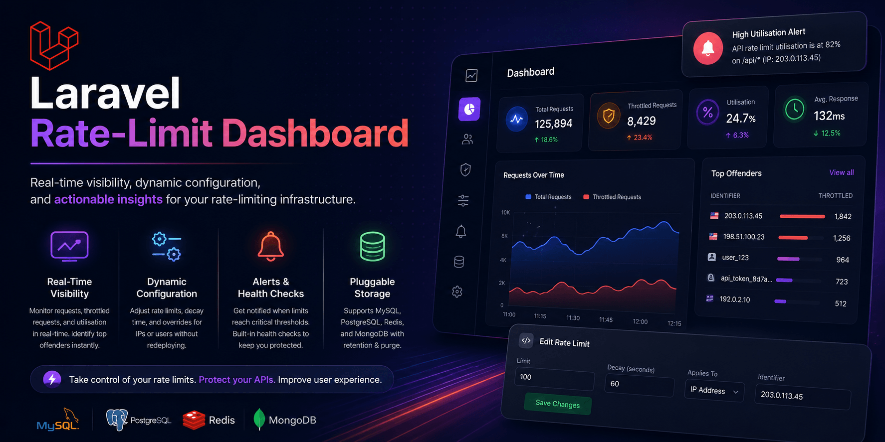

<div align="center">

# Laravel Rate-Limit Dashboard

**Real-time visibility, dynamic configuration, and actionable insights for your rate-limiting infrastructure.**



[](https://github.com/satheez/laravel-rate-limit-dashboard/actions/workflows/tests.yml)
[](https://www.php.net)
[](https://laravel.com)
[](LICENSE.md)

</div>

---

Laravel's built-in `RateLimiter` facade and throttle middleware allow you to define rate limits, but they provide **no visual interface** to monitor usage or adjust limits in production.

Laravel Rate-Limit Dashboard bridges this gap by offering a beautiful UI, dynamic configuration, and alerting, answering questions like:

> **Who is hitting the rate limits? Which endpoints are being abused? Can we adjust limits without redeploying?**

---

## The Problem

When users encounter HTTP `429 (Too Many Requests)` errors, developers traditionally have no built-in way to:

- See the offending IP or API token
- Identify exactly which endpoint is being hammered
- Adjust the rate limits gracefully without redeploying code

This leads to support tickets, unchecked abuse, and misconfigured limits.

---

## Features

**Real-Time Visibility**

- Dashboard showing total requests, throttled requests, and utilisation
- Top offenders list (IP address, user ID, API token) with throttled counts

**Dynamic Configuration**

- Edit rate-limit parameters directly from the UI without code deployment
- Per-user and per-IP overrides (e.g., lower limits for bad actors)

**Alerts & Health Checks**

- Configurable notifications via Slack, email, or webhook when limits reach critical thresholds (e.g., 80% usage)
- Built-in health checks identifying unconfigured routes, zero decay, or missing storage

**Pluggable Storage**

- Supports MySQL, PostgreSQL, Redis, and MongoDB
- Configurable data retention and automatic purge policies

---

## Installation

```bash
composer require satheez/laravel-rate-limit-dashboard
```

Publish configuration and migrations:

```bash
php artisan vendor:publish --provider="Sa\RateLimitDashboard\RateLimitDashboardServiceProvider" --tag="config"
php artisan vendor:publish --provider="Sa\RateLimitDashboard\RateLimitDashboardServiceProvider" --tag="migrations"
php artisan migrate
```

---

## Quick Start

Enable the middleware by adding it to your HTTP kernel or group:

```php
protected $middleware = [
    // ...
    \Sa\RateLimitDashboard\Http\Middleware\RateLimitInstrumenter::class,
];
```

Navigate to the dashboard route (default: `/admin/rate-limits`) and you will start seeing metrics populating automatically as requests hit your rate-limited routes.

---

## Documentation

| Document                                | Description                                           |
| --------------------------------------- | ----------------------------------------------------- |
| [Installation](docs/installation.md)    | Requirements, setup, and migrations                   |
| [Usage](docs/usage.md)                  | Dashboard usage and programmatic access               |
| [Configuration](docs/configuration.md)  | Full `config/rate-limit-dashboard.php` reference      |
| [Checks Reference](docs/checks.md)      | Built-in health checks and alert severities           |
| [Scoring & Thresholds](docs/scoring.md) | How offenders are ranked and scored                   |
| [Output & UI](docs/output.md)           | Dashboard interface details and JSON API responses    |
| [Architecture](docs/architecture.md)    | System design, instrumentation layer, data processing |
| [Comparison](docs/comparison.md)        | How this compares to Laravel Pulse, Telescope, etc.   |
| [FAQ](docs/faq.md)                      | Common questions regarding performance and setup      |

---

## Security

See [SECURITY.md](SECURITY.md) for the vulnerability reporting policy.

## License

MIT — see [LICENSE.md](LICENSE.md).
